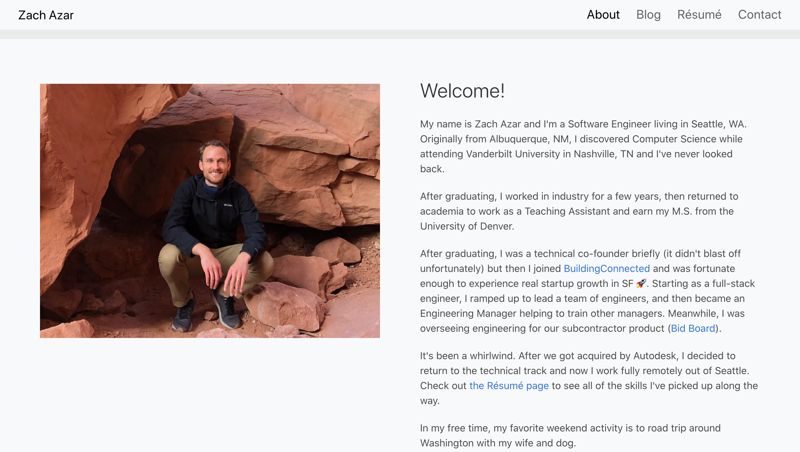
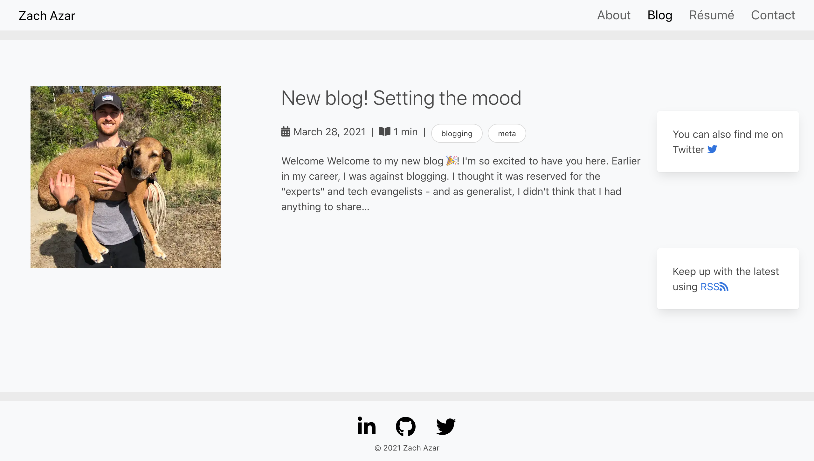
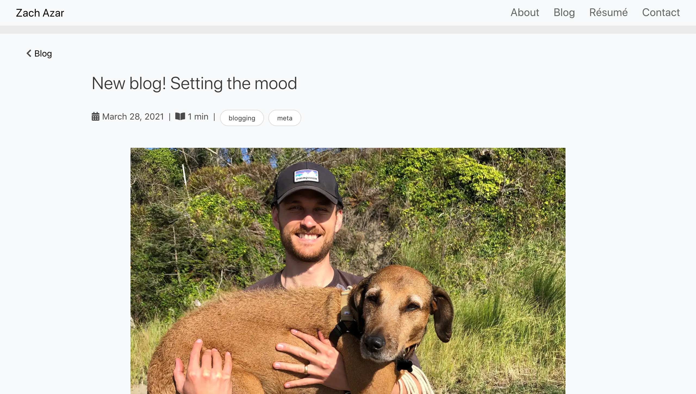
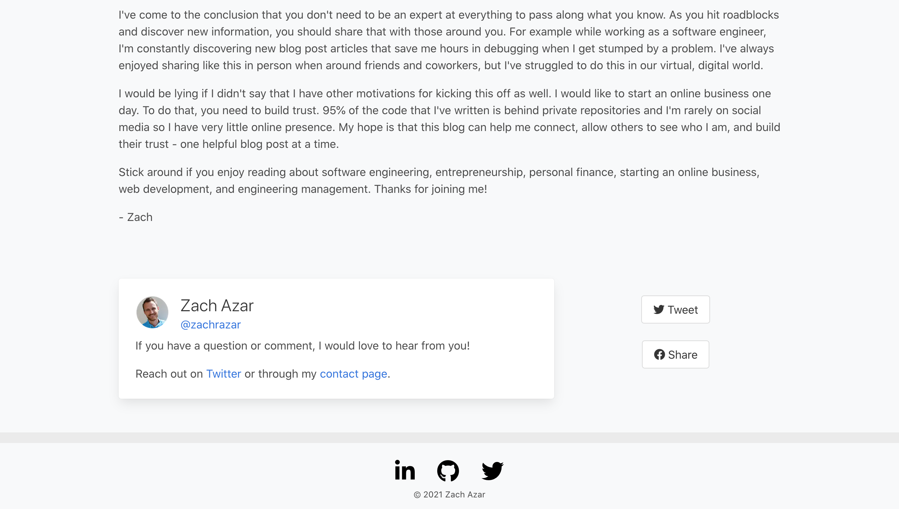
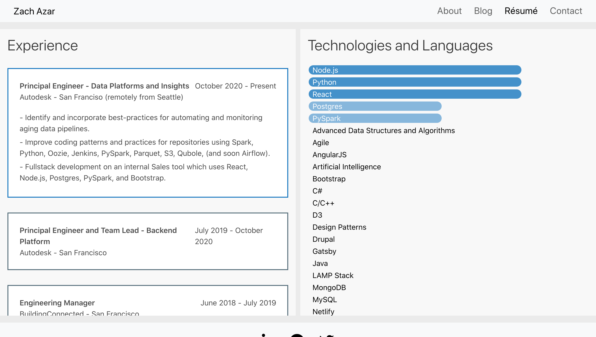
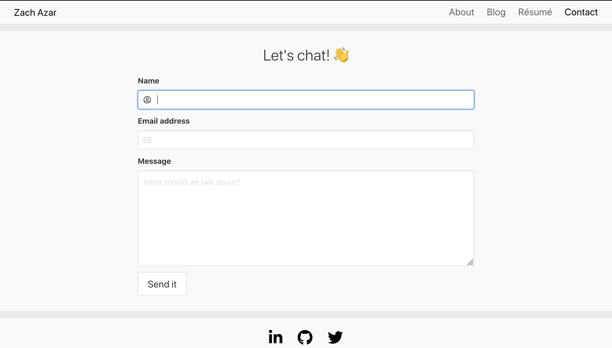
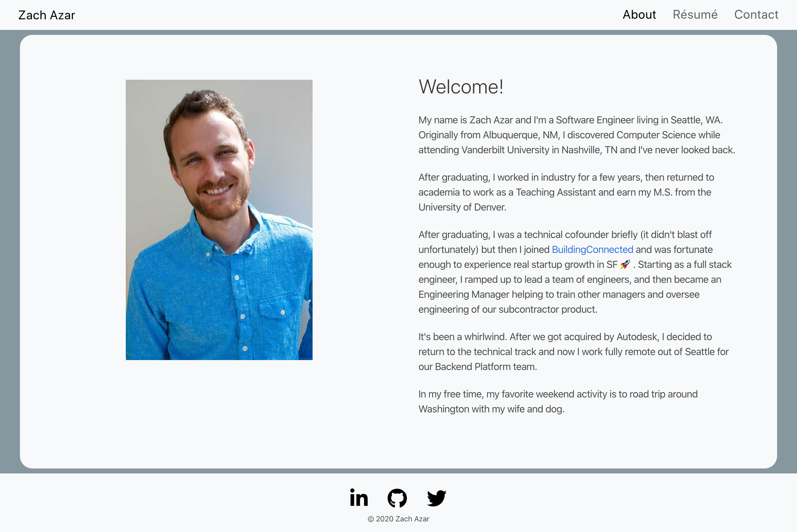
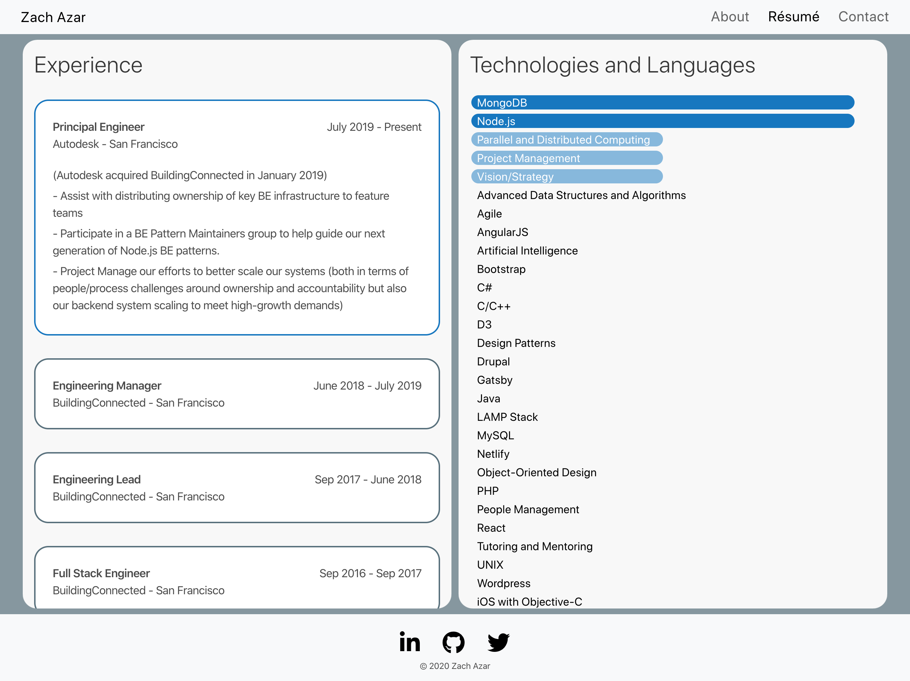
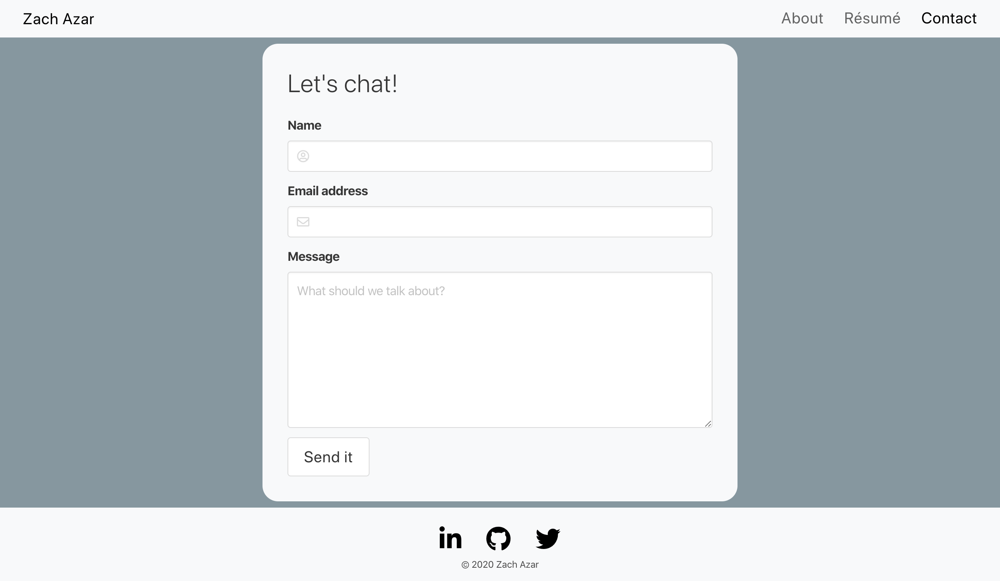

# Personal homepage.

This is v2 of [my homepage](https://www.zachazar.com/) and it uses React, Gatsby, D3, and Netlify.
[v1](https://github.com/zachazar/homepage) used Angular and D3.

## Design of v2.1

In v2.1, I redesigned the site and added a blog.

## Original design of v2

