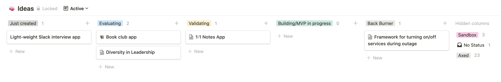

# Create → Evaluate → Validate

You should imagine your startup ideas going through three phases of a funnel: **idea creation**, **evaluation**, and **validation**.

If you're looking to improve the startup ideas that you're pursuing, you can optimize and even measure the individual sections to make your process more successful. Let's briefly discuss each.

### Idea creation

The idea creation phase is more like a lifestyle. You're deliberating putting on a new lens to try to see the problems, inconveniences, or holes in a market in the world around us. It takes time and awareness (and will be covered in a separate post). This comes naturally for some - whereas for others (like myself), we really have to practice it. You want LOTS of these flowing in.

### Evaluation

Ok, you now have ideas overflowing and you think they're as good as gold. But which ones do you pursue? We have limited time and resources - and realizing 6 months into an MVP that there's no clear path to making money with your idea can be brutal. It's time to evaluate those ideas and cut most of them using a system (this post).

### Validation

Does your product _actually_ solve a real problem? Even if the solution would scratch your own itch, do others have that same itch (and more importantly, are they willing to pay for a solution)? Resources like [the Mom Test](https://www.goodreads.com/book/show/52283963-the-mom-test) can help with this.

 
 

This post is all about the **Evaluation** section of that funnel. Most see this step as being part of validation and do it subconsciously but having it as a separate step makes this phase even more lethal to bad ideas.

# Cut most of your ideas

_This strategy is based on Tyler Tringas's ["How to Get Startup Ideas: The Meat Grinder Approach"](https://tylertringas.com/business-ideas-meat-grinder/)._

Once the ideas start flowing, they pile up. It's common for entrepreneurs (and entrepreneurial hopefuls) to have a notebook filled with them (or a virtual notebook like a Trello board, Notion page, iPhone Notes page, ... - or a combination of all of these 😄). Sound familiar?

Cut almost all of them ✂️. Keeping this notebook of scattered could-be ideas isn't helping you achieve your goals.

> _What are you talking about?! These ideas are worth at least a million bucks._

Hear me out. Ideas summed up in a few sentences in a notebook _sound_ promising and _appear_ super valuable. But they're not. Unless you're a startup veteran, most of those ideas are probably bad in that they don't meet your goals, you don't have what it takes to execute them well (and that's ok), or the market isn't actually there to support them as viable businesses.

Instead of keeping these could-be ideass sitting on the back burner for months (taking up mental energy and giving you the false sense that you have a treasure trove of startup goodness to fall back on if you lost your job), you're much better off defining your goals, creating a _system_ to help you cut those ideas, and then removing them from your mental headspace so that you can churn through more ideas to find something special.

# Define your goals

Image by <a href="https://pixabay.com/users/ben_kerckx-69781">Ben Kerckx</a> from <a href="https://pixabay.com">Pixabay</a>

Whether you're looking for a side-hustle to bring in a little extra income, aiming to replace your full-time job, or aspiring to create the next startup unicorn, you need to dig deep and define your goals. What are you looking to accomplish? Why? How much time would you like to put into it? What does your dream outcome look like? Do you want to grow a large or small company around it? Do you want to raise funding? Do you want to take on a co-founder? Is there a particular industry or market that you would prefer to be in?

For me (and this may change), I'm looking to start a small, bootstrapped business that can replace my full-time income and provide a happy work-life balance. I'm most interested in B2B SaaS through a web application.

If you're not sure what you want, explore what's out there and see what others have done! Listening to the [IndieHacker podcast](https://www.indiehackers.com/podcasts) and exploring that community helped me to see that there are more options than just the venture capital rapid growth route. (However, a great conversation I had with [Aviel Ginzburg](https://twitter.com/aviel) recently has me reconsidering the VC path).

# Build a system with questions based on your goals

Ideas sitting in a backlog are doing nothing for you. Instead, you want an idea to flow in, get evaluated with a set of questions that are driven by your goals, and then move on. If the idea seems promising, start validation around it by doing some user research and listening to others who have that problem. If not, archive it and focus your energy elsewhere.

 

**Your questions should be geared toward your goals.**

For some examples:

- if you're looking to start a unicorn startup, you should have questions about the size of the market, how you might achieve rapid growth, and how you could pitch the vision to investors.
- if you're looking to build a physical product, you might have questions like "do I have manufacturing connections who can help me design and build this?" or "how can I fund this?"
- if your goal is to start a non-profit, you might ask "is my local community facing this problem?" or "is this a viable idea for a non-profit or does this have a better chance of succeeding as a for-profit with a strong mission?"

 

Below is the list of questions that I use which are geared toward my goals. Many of these could be used in your system, but others are very specific to what I'm looking for.

I pulled all of these questions from the super talented people below who have started similar businesses to what I'm interested in:

- Courtland Allen: ["How to brainstorm great business ideas"](https://www.indiehackers.com/post/how-to-brainstorm-great-business-ideas-ab51c3d51c)
- Tyler Tringas: ["How to Get Startup Ideas: The Meat Grinder Approach"](https://tylertringas.com/business-ideas-meat-grinder/)
- Jon Yongfook: ["4 Things I Look for in New SaaS Ideas"](https://www.bannerbear.com/blog/micro-saas-evaluation-criteria/)

If you use these questions as a template, I strongly suggest reading their posts to better understand the questions and why they're worth asking.

### The Questions in my System

**What is the the problem and who have it?**

_The problem is everything - so let's only talk about the problem first. What are the pain points? Who are the personas that are encountering this problem?_

**How can I solve that problem?**

_Define your idea/solution to the problem. Don't go into every detail or technical specification, just high level._

**Do I have the skill set required to make this?**

_Can I make this solo? What skill sets am I missing? Would this have a better chance of succeeding if I take a co-founder?_

**Are people currently spending money on this? Who are the biggest competitors and is there a clear winner?**

_This takes some market research. Are people paying money to have this problem solved? How much are they paying? Is there an obvious solution that everyone in this market uses?_

**What are the distribution channels to reach them? How will I get my first 25 customers? What about the next 250?**

_If your answer is "I don't know anyone and I'll just use marketing", that's a red flag. How will you find these people? Can that strategy scale?_

**If it works, will the business be sustainable? Long term, how do I stay competitive?**

_Will this business be able to last long term? What moats will I aim to develop? What's keeping Facebook from just building this in a week and crushing me?_

**Am I the person to build this business? Would I enjoy this in the day-to-day?**

_Be honest here. It might take years for this to pick up. Would you enjoy solving this problem day-after-day in the long-term?_

**If this is a micro-Sass solution: is it too innovative and new? Is it low maintenance for the customer?**

_Micro-SaaS should be set-it-and-forget it for users (and not require a massive Marketing and Sales budget to convince users that they have the problem to begin with)_

## My system

I use a Kanban board in Notion to power my system.

When I have a new idea, I create a card in "Just created". Once I'm ready to evaluate it, I turn the card into a page using a template with the questions above. I run through the questions, highlight the red flags and opportunities, and then move the card forward as the answer becomes more clear on whether I should put more time into the idea or not.

### Try it out 🚀

[Here is a Kanban board in Notion](https://www.notion.so/Evaluating-startup-ideas-1c67681a35e64d7a930a0aa959d557d2) that you can duplicate and start using. It includes a template with the questions above that you can edit to match your goals.

### Brain tricks

My brain fights this process and naturally wants to stockpile ideas instead (even though I know this system works _way_ better than stockpiling).

To help me avoid that, I use the following brain tricks:

- I try to fill these questions out pretty quickly so that I don't have the friction of the process cause me to make excuses and not do it.
- I highlight red flags as I'm typing to help convince my brain that something doesn't feel right and that it's OK to cut this idea.

 

**_Now spend an afternoon *actually* evaluating those ideas that you have pilled up, cut through the ideas that don't match your goals using a system, and find the gem that you should focus on *now.*_**

 

Good luck! Let me know how this process is working out for you.
