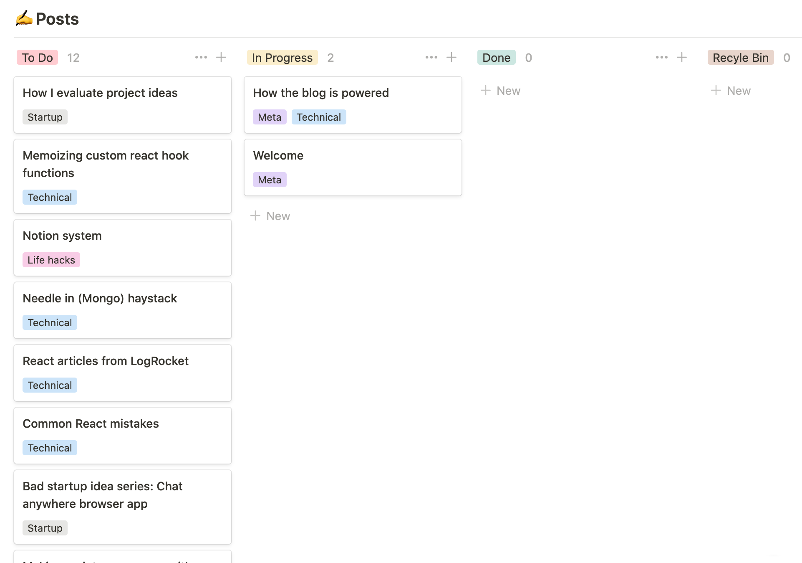

# Welcome

Welcome to my new blog 🎉! I'm so excited to have you here.

Earlier in my career, I was against blogging. I thought it was reserved for the "experts" and tech evangelists - and as generalist, I didn't think that I had anything to share.

However after I overcame a tricky [React](https://reactjs.org/) error the other day, I wanted to share my discovery with others. I wrote it down (somewhat jokingly) in a _This Would Make a Good Blog Post_ list. The list kept growing and growing. I threw the list into a [Kanban board](https://www.atlassian.com/agile/kanban) and set out to create a blog.

I've come to the conclusion that you don't need to be an expert at everything to pass along what you know. As you hit roadblocks and discover new information, you should share that with those around you. For example while working as a software engineer, I'm constantly discovering new blog post articles that save me hours in debugging when I get stumped by a problem. I've always enjoyed sharing like this in person when around friends and coworkers, but I've struggled to do this in our virtual, digital world.

I would be lying if I didn't say that I have other motivations for kicking this off as well. I would like to start an online business one day. To do that, you need to build trust. 95% of the code that I've written is behind private repositories and I'm rarely on social media so I have very little online presence. My hope is that this blog can help me connect, allow others to see who I am, and build their trust - one helpful blog post at a time.

Stick around if you enjoy reading about software engineering, entrepreneurship, personal finance, starting an online business, web development, and engineering management. Thanks for joining me!

\- Zach
